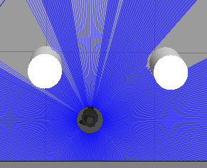

# YILDIZ ROVER - Ödev 4

Turtlebot3'ü gazebo ortamında belirli bir konuma ulaştırma.

## 🛠️ Sistem Gereksinimleri
* Ubuntu 22.04 kullanıldı.
* [cite_start]ROS 2 Humble 
* Turtlebot3 ve Gazebo ROS 2 paketleri

## 🚀 Nasıl Çalıştırılır?

1. Yeni bir terminal açın ve engelli yada engelsiz Gazebo ortamını başlatın:
```bash
ros2 launch turtlebot3_gazebo turtlebot3_world.launch.py
ros2 launch turtlebot3_gazebo empty_world.launch.py

2.Terminalde:
cd ~/ros2_ws
colcon build --packages-select gazebo_turtle_controller
source install/setup.bash

ros2 run gazebo_turtle_controller robot_controller

```
## Simülasyon Görüntüleri



